# Relay — Good conversations. Closer connections.

Java 17 / Spring Boot 3.4.2 chat application with public messages, one-to-one messages, shareable private rooms and JPEG/PNG/GIF uploads. Open http://localhost:8081 after starting it.

## Screenshots

Captured from the running application on 7 October 2026. Chat screenshots use demonstration conversations. All images live in [docs/screenshots](docs/screenshots/).

### Desktop sign-in

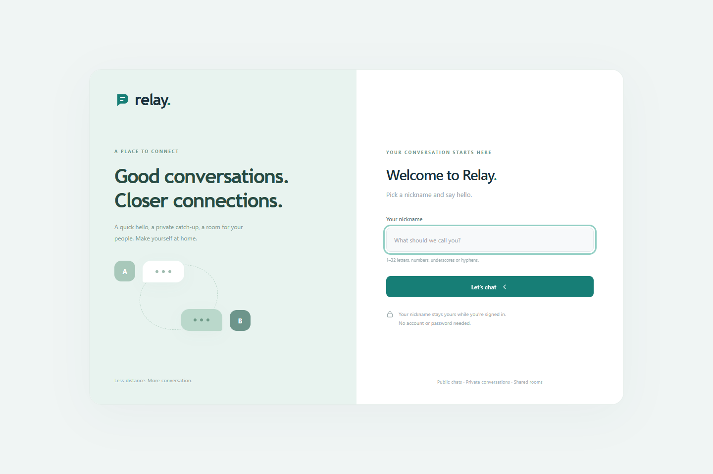

### Public lounge

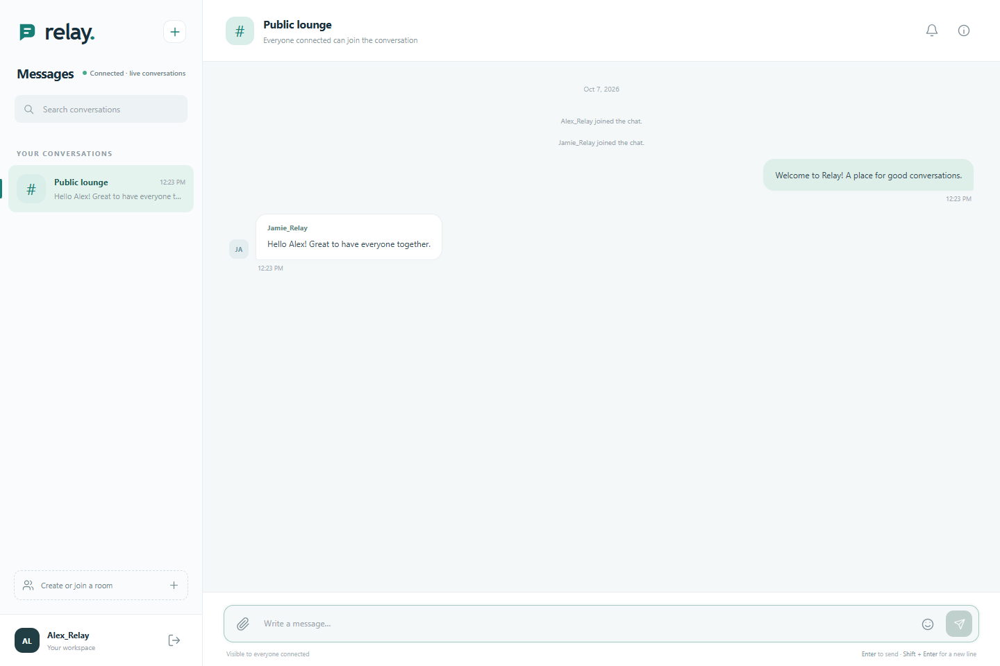

### Private conversation

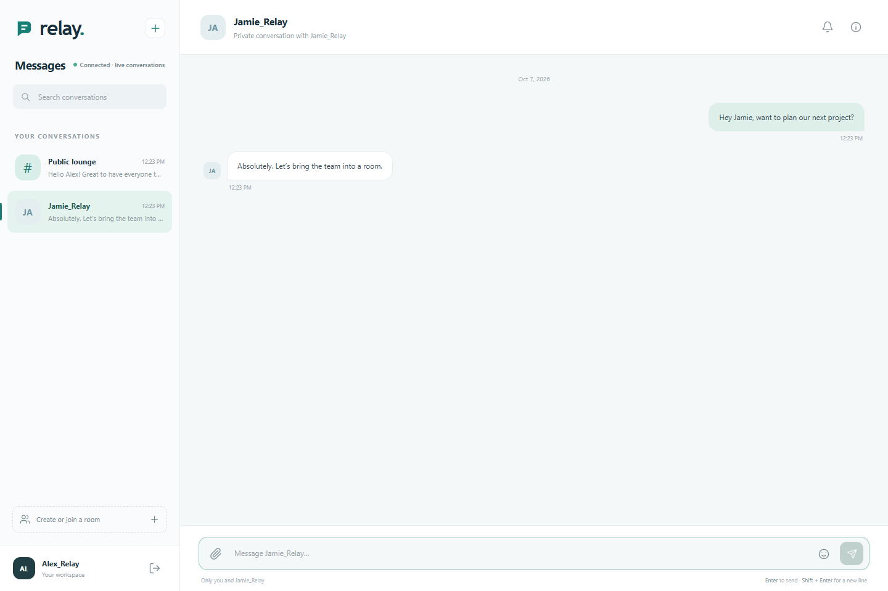

### Private room and member details

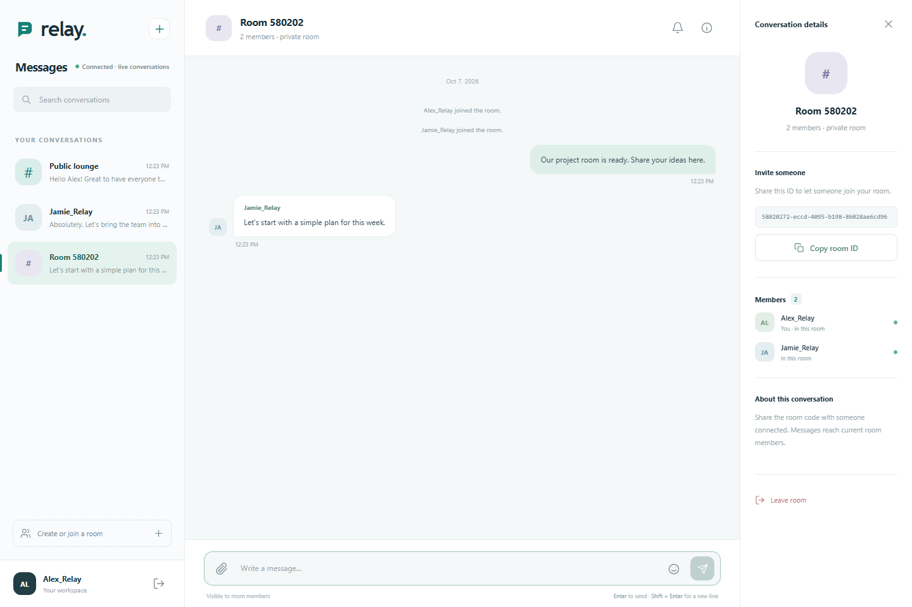

### New conversation dialog

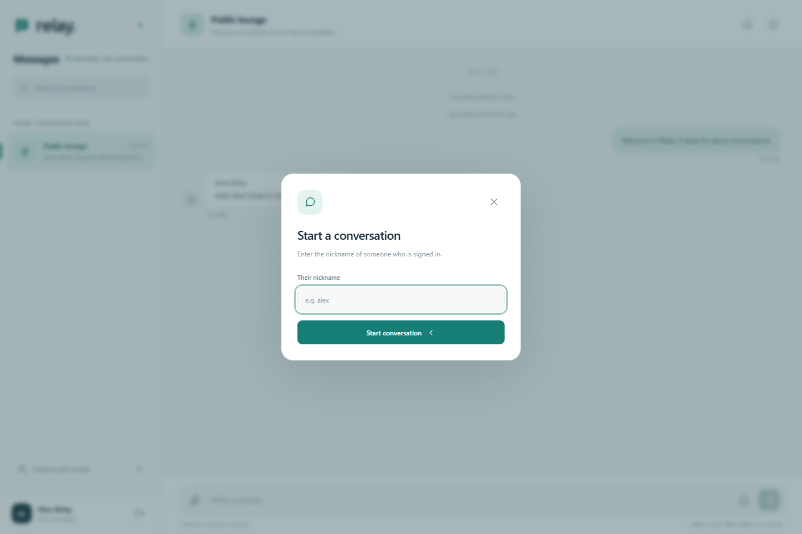

### Create or join room dialog

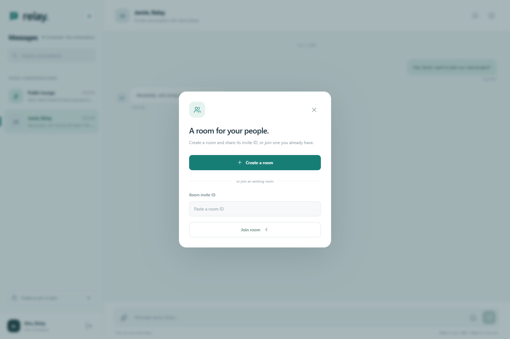

### Image attachment preview

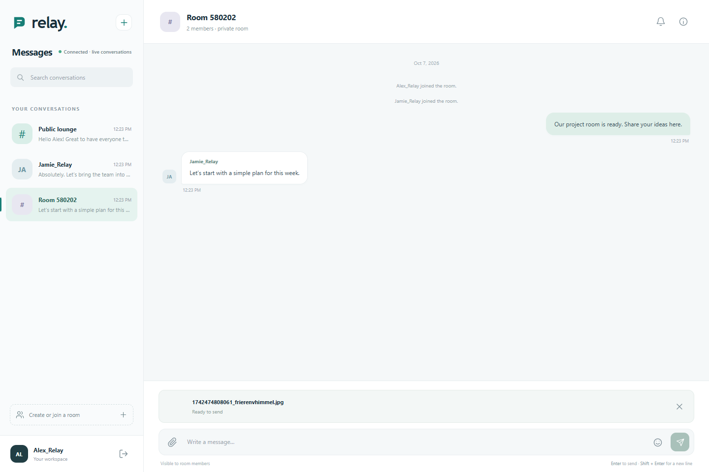

### Emoji picker

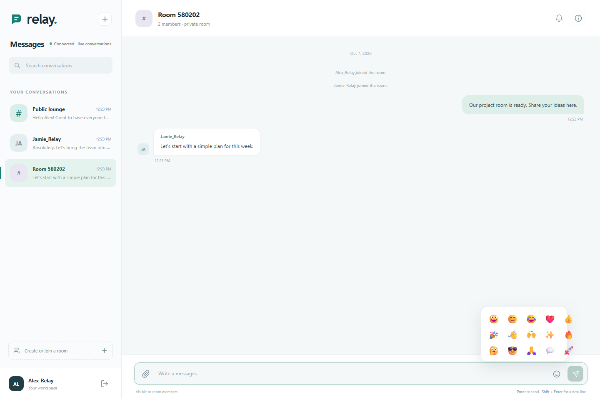

### Mobile sign-in

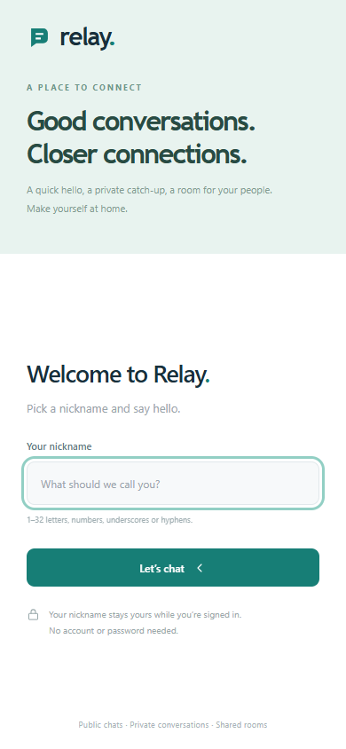

### Mobile conversation list

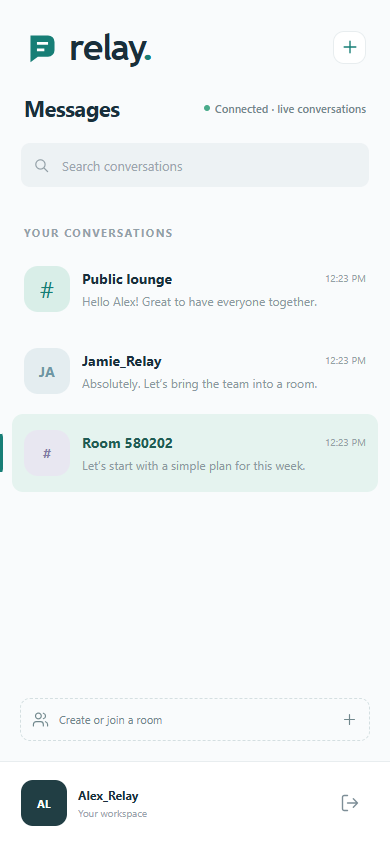

### Mobile chat

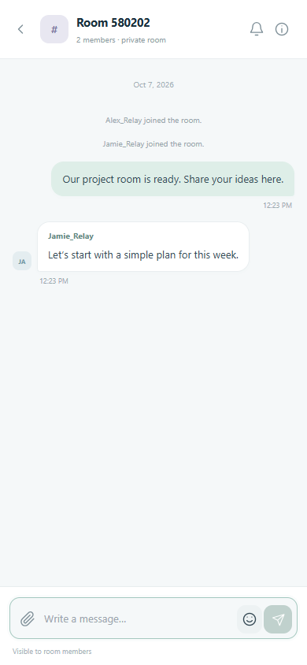

### Leaderboard backend preview

The separate backend exposes JSON APIs. These images show real responses formatted for readability; it has no standalone web UI. See [all backend screenshots](leaderboard/README.md#api-screenshots).

## Run locally

Requires a JDK 17. The Maven wrapper downloads Maven 3.9.9 and dependencies on first use.

Windows PowerShell:

~~~powershell
.\mvnw.cmd spring-boot:run
~~~

macOS/Linux:

~~~sh
./mvnw spring-boot:run
~~~

Or build and run the executable JAR:

~~~powershell
.\mvnw.cmd package
java -jar target/real-time-chat-0.0.1-SNAPSHOT.jar
~~~

Choose an available nickname containing 1–32 letters, numbers, underscores or hyphens. Open another browser/profile with another nickname to try private messaging. Use the + button to start a private conversation. The sidebar keeps public, private and room messages separate, with unread counts and search. Use Create or join a room, then share the code from Conversation details. Leave room is also in that panel. On mobile, the back arrow returns to conversations. Enter sends; Shift+Enter adds a line. Images have a removable preview, and emoji can be inserted from the composer. Drafts are kept until the server confirms the send.

## Session and privacy model

This is a nickname-based demo, with no password accounts or durable identity verification. Nicknames are reserved while their HTTP session is active. The server derives message senders from that session and rejects anonymous WebSocket connections, forged destinations, and room sends by nonmembers. Logging out or expiring the session closes its sockets and removes room membership. Multiple tabs share one HTTP identity but have separate room membership.

Room IDs are shareable invite codes: anyone signed in who knows a live room ID can join. Room delivery uses a session-specific user queue rather than an externally subscribable room topic. Private messages use Spring user destinations. Uploaded images have publicly retrievable URLs; avoid sharing sensitive images in this demo.

Messages and rooms are held in memory. Refreshing clears displayed messages; restarting clears room state. Uploads are kept on disk. There are no saved chat histories, read receipts, or account recovery features.

## Uploads and configuration

Images are checked by actual format and decoding, limited to 10MB and 20 million pixels, saved under random filenames, and protected by login and CSRF checks. A failed upload keeps the draft and attachment available for retry. Default upload directory: uploads/images. Default disk quota: 250MB.

Override properties with Spring command-line arguments or environment variables, for example FILE_UPLOAD_DIR, FILE_UPLOAD_QUOTA_BYTES, SERVER_PORT, SERVER_SERVLET_SESSION_COOKIE_SECURE. Enable secure cookies when deploying behind HTTPS. Session timeout is 30 minutes. Browser libraries are bundled locally; notifications require browser support and permission via the Notifications button.

## Tests

~~~powershell
.\mvnw.cmd test
node --test src/test/js/main.test.cjs
~~~

Java tests run real HTTP/WebSocket servers on random local ports. They cover sender identity, private image messages, room access and logout cleanup, broker destination restrictions, nickname validation/duplicates, CSRF, and validated uploads. Frontend tests cover room controls, conversation isolation, unread counts, private routing, rejected drafts, confirmed sends, and upload retry state.

## Docker

~~~sh
docker build -t real-time-chat .
docker run -d -p 8081:8081 --mount source=chat-images,target=/data/images --name chat-app real-time-chat
~~~

The build runs Java tests. The runtime runs as a non-root user. The named volume retains uploads when the container is recreated.

## Endpoints

HTTP: GET /, GET /login, POST /login, POST /logout, POST /upload, GET /images/*.
SockJS: /ws.
STOMP sends: /app/chat.sendMessage, /app/chat.addUser, /app/chat.sendPrivateMessage, /app/chat.createPrivateRoom, /app/chat.joinRoom, /app/chat.leaveRoom, /app/chat.sendRoomMessage.
Subscriptions: /topic/publicChatRoom, /user/queue/private, /user/queue/room.
Room changes return structured ROOM_JOINED/ROOM_LEFT messages; application failures return ERROR messages to the originating session.

User-destination routing follows [Spring’s documented user destinations](https://docs.spring.io/spring-framework/reference/web/websocket/stomp/user-destination.html).

Original author: Do Minh Chinh.

## Separate leaderboard backend

The independent [leaderboard backend](leaderboard/README.md) adds Redis sorted sets, password authentication, score history, live SSE updates and period reports. It runs on port 8090 independently of chat.
