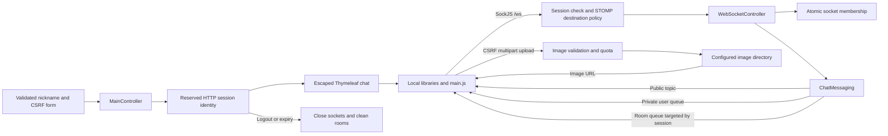

# Workspace map

Updated 2026-10-07 after repairs. Root: `D:\freelance\real-time-chat`. 42 source/documentation/assets files listed below. Git internals, generated target/ output, ignored .tools/ caches/logs/screenshots and new runtime uploads are excluded. No project AGENTS.md was found.

## Application

Java 17 + Spring Boot 3.4.2 + Thymeleaf + plain JavaScript. SockJS/STOMP delivers public, private and room messages. Port 8081. Nickname sessions and rooms remain in memory; uploads remain on disk. No password accounts or persistent message history.

## Every project file

| File | Job |
|---|---|
| [.dockerignore](.dockerignore) | Keeps repository metadata, local tools, builds and uploads out of Docker context. |
| [.gitattributes](.gitattributes) | Maven wrapper line-ending rules. |
| [.gitignore](.gitignore) | Excludes build outputs, IDE files, local tool caches, logs and new uploads. |
| [.mvn/wrapper/maven-wrapper.properties](.mvn/wrapper/maven-wrapper.properties) | Pins Maven 3.9.9 and wrapper 3.3.2. |
| [Dockerfile](Dockerfile) | Java 17 multistage build that runs tests; non-root runtime; persistent upload volume. |
| [README.md](README.md) | Current run/test commands, endpoints, configuration and demo limitations. |
| [WORKSPACE_MAP.md](WORKSPACE_MAP.md) | This file-by-file map, resolved issues and verification results. |
| [mvnw](mvnw) | Unix Maven wrapper launcher. |
| [mvnw.cmd](mvnw.cmd) | Windows Maven wrapper launcher. |
| [pom.xml](pom.xml) | Java 17 / Spring Boot 3.4.2 dependencies and JAR packaging. |
| [src/main/java/com/chinhbean/realtimechat/RealTimeChatApplication.java](src/main/java/com/chinhbean/realtimechat/RealTimeChatApplication.java) | Starts Spring Boot. |
| [src/main/java/com/chinhbean/realtimechat/config/HttpSessionConfig.java](src/main/java/com/chinhbean/realtimechat/config/HttpSessionConfig.java) | Registers servlet session destruction listener to revoke nicknames and close sockets. |
| [src/main/java/com/chinhbean/realtimechat/config/SecurityHeadersFilter.java](src/main/java/com/chinhbean/realtimechat/config/SecurityHeadersFilter.java) | Sets nosniff, referrer policy and a content security policy for local assets. |
| [src/main/java/com/chinhbean/realtimechat/config/WebConfig.java](src/main/java/com/chinhbean/realtimechat/config/WebConfig.java) | Maps configured image storage; enforces login/CSRF on login, logout and uploads. |
| [src/main/java/com/chinhbean/realtimechat/config/WebSocketConfig.java](src/main/java/com/chinhbean/realtimechat/config/WebSocketConfig.java) | SockJS endpoint, ordered messaging, trusted STOMP identity, destination allowlists and explicit policy socket closure. |
| [src/main/java/com/chinhbean/realtimechat/controller/FileUploadController.java](src/main/java/com/chinhbean/realtimechat/controller/FileUploadController.java) | Checks size, actual JPEG/PNG/GIF decoding and dimensions, enforces storage quota, writes random safe filenames and returns real HTTP errors. |
| [src/main/java/com/chinhbean/realtimechat/controller/MainController.java](src/main/java/com/chinhbean/realtimechat/controller/MainController.java) | Renders login/chat, validates and reserves nicknames, rotates sessions, renders CSRF tokens, POST logout. |
| [src/main/java/com/chinhbean/realtimechat/controller/WebSocketController.java](src/main/java/com/chinhbean/realtimechat/controller/WebSocketController.java) | Public/private/room handlers derive sender from Principal; validate payloads and memberships; return structured room acknowledgments and per-session errors. |
| [src/main/java/com/chinhbean/realtimechat/interceptor/HttpHandshakeInterceptor.java](src/main/java/com/chinhbean/realtimechat/interceptor/HttpHandshakeInterceptor.java) | Rejects sessions without a reserved nickname; copies trusted HTTP username/session ID into socket attributes. |
| [src/main/java/com/chinhbean/realtimechat/listener/WebSocketEventListener.java](src/main/java/com/chinhbean/realtimechat/listener/WebSocketEventListener.java) | Tracks connected socket identities, cleans room membership on disconnect and preserves multi-tab presence. |
| [src/main/java/com/chinhbean/realtimechat/model/ChatMessage.java](src/main/java/com/chinhbean/realtimechat/model/ChatMessage.java) | JSON payload and event types; includes sender, recipient, content, image URL, room ID/member list and server timestamp. |
| [src/main/java/com/chinhbean/realtimechat/service/ChatMessaging.java](src/main/java/com/chinhbean/realtimechat/service/ChatMessaging.java) | Sends public/user/session messages; room deliveries target only currently joined sessions. |
| [src/main/java/com/chinhbean/realtimechat/service/ChatRooms.java](src/main/java/com/chinhbean/realtimechat/service/ChatRooms.java) | Synchronizes socket-based room membership, atomic switching, snapshots and empty-room cleanup. |
| [src/main/java/com/chinhbean/realtimechat/service/ChatSessions.java](src/main/java/com/chinhbean/realtimechat/service/ChatSessions.java) | Reserves nicknames, validates active HTTP identities, tracks open sockets, rejects policy violations and revokes sessions. |
| [src/main/resources/application.properties](src/main/resources/application.properties) | Port, image directory/quota, multipart limits and session cookie/timeout configuration. |
| [src/main/resources/static/css/main.css](src/main/resources/static/css/main.css) | Active shared styles with responsive layout and scrollable message list. |
| [src/main/resources/static/images/1742474787082_wave.jpg](src/main/resources/static/images/1742474787082_wave.jpg) | Original bundled JPEG, served under /images/. |
| [src/main/resources/static/images/1742474808061_frierenvhimmel.jpg](src/main/resources/static/images/1742474808061_frierenvhimmel.jpg) | Original bundled JPEG, served under /images/. |
| [src/main/resources/static/images/1742474857571_sometime.jpeg](src/main/resources/static/images/1742474857571_sometime.jpeg) | Original bundled JPEG, served under /images/. |
| [src/main/resources/static/js/main.js](src/main/resources/static/js/main.js) | Browser connections/retry, private and room queues, safe DOM rendering, upload retry state, server timestamps and optional notifications. |
| [src/main/resources/static/js/vendor/README.md](src/main/resources/static/js/vendor/README.md) | Bundled-library license/provenance documentation. |
| [src/main/resources/static/js/vendor/SOCKJS-LICENSE.txt](src/main/resources/static/js/vendor/SOCKJS-LICENSE.txt) | Bundled-library license/provenance documentation. |
| [src/main/resources/static/js/vendor/STOMP-LICENSE.txt](src/main/resources/static/js/vendor/STOMP-LICENSE.txt) | Bundled-library license/provenance documentation. |
| [src/main/resources/static/js/vendor/sockjs.min.js](src/main/resources/static/js/vendor/sockjs.min.js) | Bundled upstream browser library, removing runtime CDN dependence. |
| [src/main/resources/static/js/vendor/stomp.min.js](src/main/resources/static/js/vendor/stomp.min.js) | Bundled upstream browser library, removing runtime CDN dependence. |
| [src/main/resources/templates/chat.html](src/main/resources/templates/chat.html) | Escaped chat template; public/private/room controls, image picker, status feedback and logout form. |
| [src/main/resources/templates/login.html](src/main/resources/templates/login.html) | Validated nickname form, CSRF field, error feedback and responsive login layout. |
| [src/test/java/com/chinhbean/realtimechat/ChatIntegrationTests.java](src/test/java/com/chinhbean/realtimechat/ChatIntegrationTests.java) | Real HTTP/WebSocket integration tests: identity, private images, room access/cleanup, broker policy, login/CSRF and uploads. |
| [src/test/java/com/chinhbean/realtimechat/ChatRoomsTests.java](src/test/java/com/chinhbean/realtimechat/ChatRoomsTests.java) | Tests multi-tab membership, unknown-room rejection, empty-room removal and failed-switch preservation. |
| [src/test/java/com/chinhbean/realtimechat/RealTimeChatApplicationTests.java](src/test/java/com/chinhbean/realtimechat/RealTimeChatApplicationTests.java) | Spring application context smoke test. |
| [src/test/js/main.test.cjs](src/test/js/main.test.cjs) | Four Node VM regression tests for room controls, safe rendering, private routing and failed-upload drafts. |
| [uploads/images/1742475106448_wallpaperflare.com_wallpaper.jpg](uploads/images/1742475106448_wallpaperflare.com_wallpaper.jpg) | Original uploaded JPEG retained; new runtime uploads are ignored by Git. |

## Current flow

HTTP: GET /, GET /login, POST /login, POST /logout, POST /upload, GET /images/*. SockJS: /ws. STOMP sends keep existing /app/chat.* handler names. Allowed subscriptions are /topic/publicChatRoom, /user/queue/private and /user/queue/room. Room IDs are shareable invite codes for signed-in users; joining an unknown room fails. Room delivery checks current membership and targets that socket rather than a freely subscribable room topic.

## Issues resolved

| Original finding | Result |
|---|---|
| Anonymous sockets and forged sender names | Handshake requires active server session; Principal supplies sender; client sender ignored. |
| Duplicate nickname / multiple-tab collisions | HTTP session reserves nickname; room membership keys are socket IDs; presence stays online while another socket remains. |
| Unauthorized broker and room access | Exact SEND/SUBSCRIBE allowlists; offending socket closed; room sends/deliveries checked against membership. |
| Broken private routing / missing recipient control | Standard Spring user destinations and recipient input; tested recipient and sender delivery. |
| HTML injection | Escaped Thymeleaf username, DOM textContent, nickname validation and CSP. |
| Unsafe/unprotected uploads | Login + CSRF, actual image decoding, size/dimension/quota checks, random filenames, configured path and HTTP errors. |
| Wrong room unsubscribe / hidden Leave button | Static session room queue removes dynamic subscription lifecycle; structured acknowledgments control Leave visibility. |
| Null-content private crash | Image-only payloads supported; no content-string parsing for room creation. |
| Stale/unsafe room state | Synchronized membership and atomic switches, disconnect/logout/expiry cleanup, empty-room removal. |
| Failed uploads lose drafts | Text/attachment kept on upload failure with visible feedback. |
| Fake avatars / unused media fields | Removed placeholder/unused payload fields and corrected feature claims. |
| Local receive timestamps | Server timestamps included and rendered. |
| Notification/support and reconnect failures | Optional support check and permission button; bounded reconnect retry. |
| Commented CSS / mobile overflow | Active shared CSS, responsive controls and corrected feedback sizing. |
| Docker skipped tests / lost images | Build runs tests; wrapper/build Maven aligned; non-root runtime with named image volume instructions. |
| Misleading README/config | Accurate nickname model, upload setting, limits, run/test/deployment commands. |

## Verification

Java regression suite: 10 tests (6 real HTTP/WebSocket integration tests, 3 room-state tests, 1 context smoke test). Frontend: 4 Node VM tests. Headless Chrome smoke test covers two isolated identities, public/private delivery, room create/join/leave and member updates, image upload/rendering, failed-upload draft retention, mobile overflow and logout. No browser JavaScript errors observed. Desktop/mobile screenshots stored in ignored .tools/.

Maven/dependencies are cached under .tools/ because normal terminal sandbox startup failed. The project wrapper successfully builds through the permitted execution path. Runnable JAR: target/real-time-chat-0.0.1-SNAPSHOT.jar. Background app logs: .tools/app.log and .tools/app-error.log; current process ID: .tools/app.pid. README has standard commands to restart independently. Docker image configuration was updated but not built or run.

## Deliberate demo limits

Nicknames are not password accounts. Name ownership lasts only as long as the active HTTP session. Room ID possession permits joining; uploaded URLs are publicly retrievable. Chat history and room state are not durable. These limits are documented rather than presented as implemented features.

Routing follows [Spring user destinations](https://docs.spring.io/spring-framework/reference/web/websocket/stomp/user-destination.html); receive/publish ordering follows [Spring message-order settings](https://docs.spring.io/spring-framework/reference/web/websocket/stomp/ordered-messages.html).
