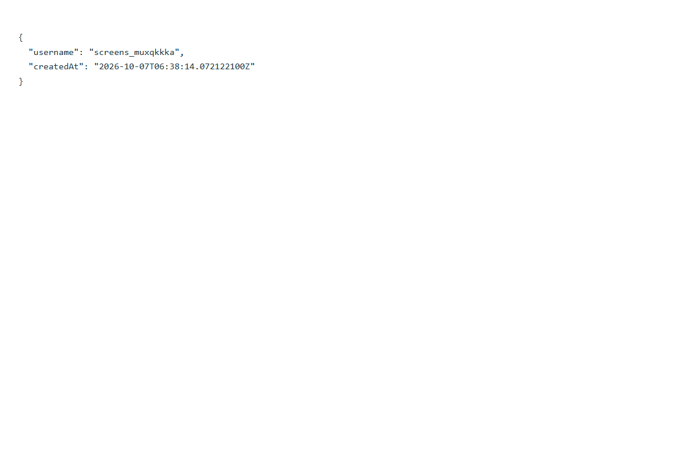
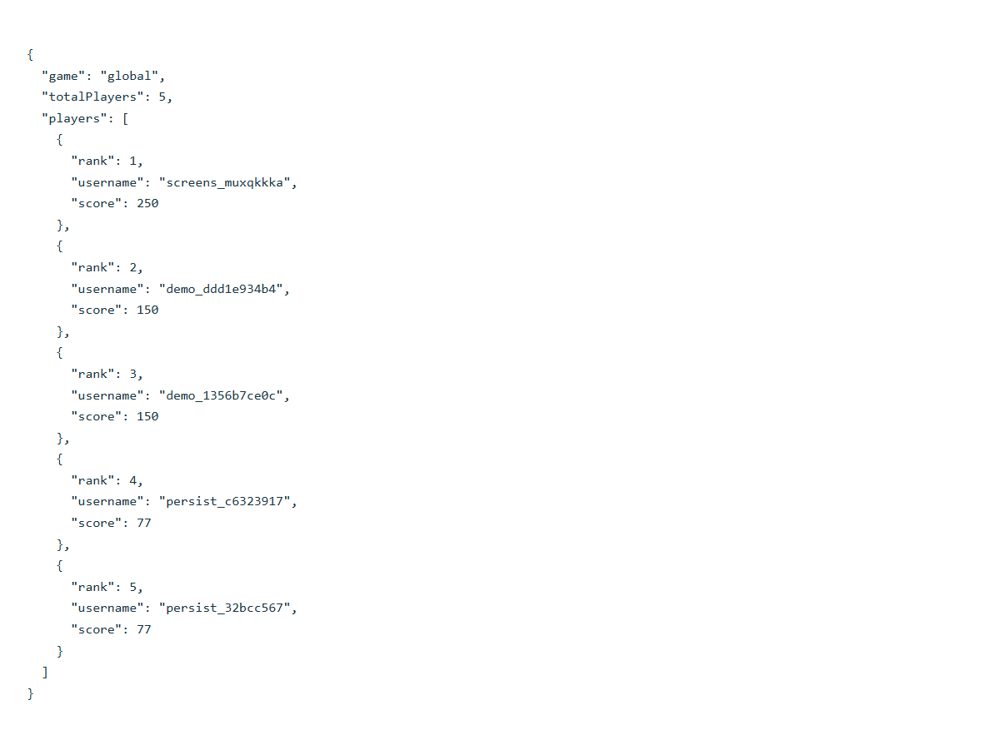
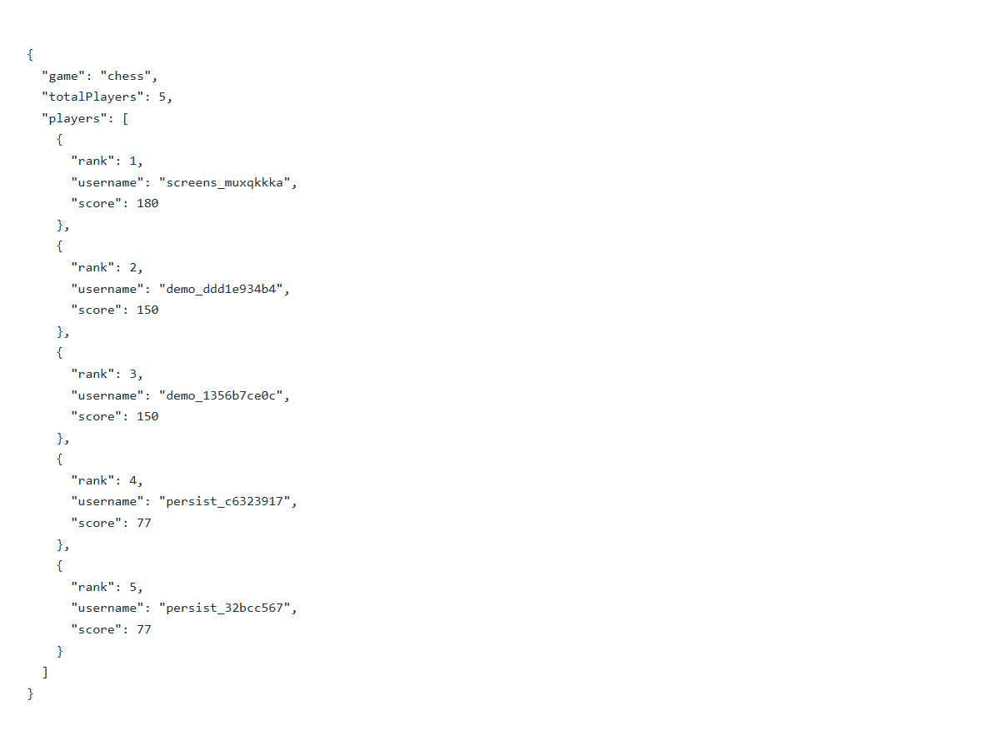
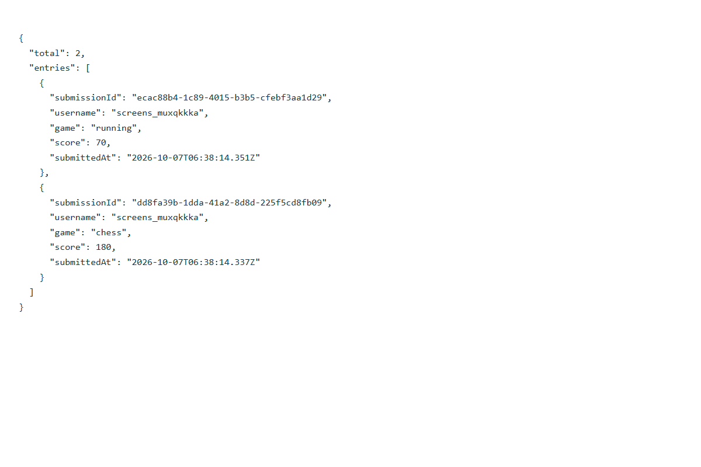
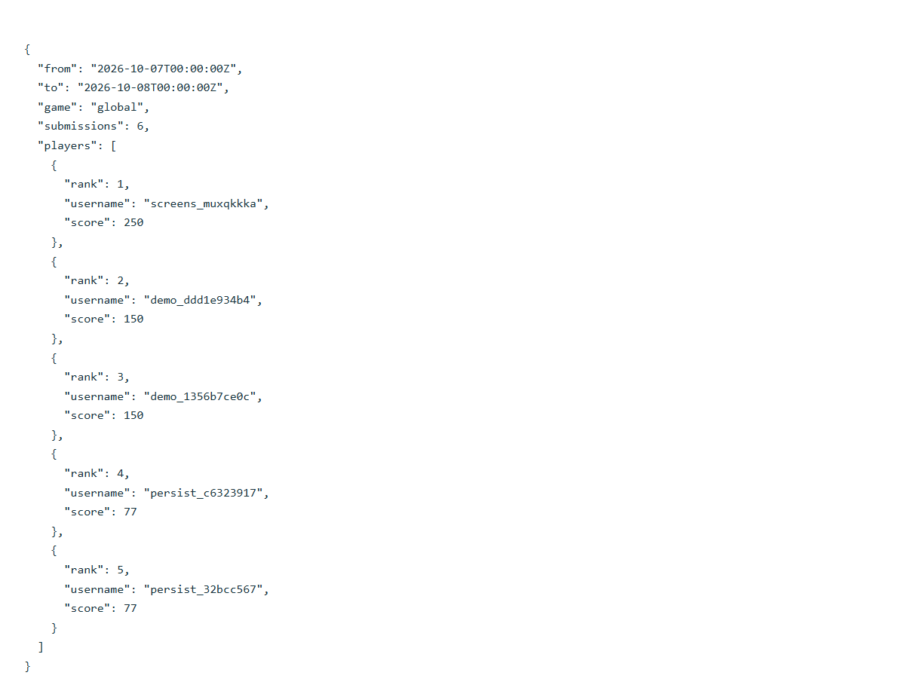

# Real-time leaderboard backend

Independent Java 17 / Spring Boot 3.4.2 service. The chat application remains separate. Default API port: **8090**. Storage and live events use real Redis.

## Run

Docker Compose runs Redis 7.4 with append-only persistence:

~~~sh
cd leaderboard
docker compose up --build -d
curl http://localhost:8090/api/health
~~~

Redis is internal to the Compose network; the API is exposed on localhost. The named volume retains data when containers are recreated. AOF uses appendfsync everysec, so a sudden Redis/host failure can lose about one second of recent writes.

Without Docker, start Redis first, then use the existing Maven wrapper from the workspace root:

~~~powershell
$env:REDIS_PORT = '6379'
.\mvnw.cmd -f leaderboard/pom.xml package -Dredis.test.port=6379
java -jar leaderboard/target/leaderboard-1.0.0.jar
~~~

Integration tests require real Redis. They use a fresh random namespace and clean only that namespace; they never flush your database. The production namespace is lb:{leaderboard}:. This workspace's verified local Redis runs on **6385**, with persistence in ignored leaderboard/data/:

~~~powershell
$env:REDIS_PORT = '6385'
java -jar leaderboard/target/leaderboard-1.0.0.jar
# Another terminal:
powershell -File leaderboard/demo.ps1
~~~

Environment: PORT (8090), REDIS_HOST (localhost), REDIS_PORT (6379), REDIS_PASSWORD (empty), LEADERBOARD_PREFIX (lb:{leaderboard}:), SESSION_SECONDS (86400; allowed 60–604800). Spring Redis SSL properties may be supplied for a TLS service. Use HTTPS for remote clients and keep Redis private.

## Scoring rules

- Each submission adds **1–1,000,000 points**. Scores accumulate, rather than replace previous scores or track personal bests.
- Game/activity slugs use lowercase letters, digits, underscores or hyphens, 1–40 characters, beginning with a letter or digit. The first accepted score creates a game.
- Global score sums all accepted points across games. Each game's board sums only its own points.
- Redis sorted sets use ZINCRBY, ZREVRANGE and ZREVRANK. A Lua script updates totals, history indexes, idempotency receipts and publication in one operation.
- Ranks are one-based ordinal positions. Ties use username descending lexicographic order, matching Redis reverse ranking.
- Users without submissions have null rank/score. Unknown games yield empty boards.
- Cumulative totals are capped at 9,000,000,000,000,000 to retain exact integer precision.
- A new UUID submissionId identifies each real result. Retry the same ID with the same game and score to receive the original receipt without adding points or publishing again. Changed data returns 409. IDs are per-user and retained permanently.
- User identity and millisecond UTC submission timestamps come from the server.
- Scores are self-reported for this imaginary project. A competitive deployment should accept verified results from trusted game servers.

## Authentication

Register/log in with JSON {"username":"alice","password":"strong-password"}. Usernames normalize to lowercase and contain 3–32 letters, digits, underscores or hyphens. Passwords need at least 8 characters and at most 72 UTF-8 bytes; BCrypt cost 12 protects them.

Login returns token, username and expiresAt. Send **Authorization: Bearer TOKEN** on all endpoints except register/login/health. Tokens are random 256-bit credentials; Redis stores only SHA-256 digests with TTL. Logout revokes the current token. Cookies do not authenticate requests.

Fixed-window limits: registration 10/minute per source IP, login 30/minute per IP, scores 120/minute per user. 429 includes Retry-After: 60. Direct source IP is used; configure proxy-aware limits before a public deployment.

## API

Ordinary bodies/responses are JSON; errors use application/problem+json.

| Method | Endpoint | Behavior |
|---|---|---|
| GET | /api/health | Public Redis readiness |
| POST | /api/auth/register | Create account; 201 |
| POST | /api/auth/login | Issue Bearer token |
| POST | /api/auth/logout | Revoke token; 204 |
| GET | /api/me | Current account |
| POST | /api/scores | Submit {submissionId, game, score}; 201 or 200 on retry |
| GET | /api/games | Sorted list of games |
| GET | /api/leaderboards | Global board; optional game, offset, limit |
| GET | /api/rankings/me | Own rank; optional game |
| GET | /api/scores/history | Own history; offset, limit |
| GET | /api/reports/top-players | Required from, to; optional game, limit |
| GET | /api/leaderboards/stream | SSE snapshots/score updates; optional game |

Pagination: offset 0–10000, limit 1–100. Board default limit 10; history 20. Board responses include totalPlayers and ranked players. History is newest first, with UUID, username, game, score and submittedAt. Same-millisecond history ties use reverse event-ID order.

Reports aggregate points submitted in **[from, to)** using ISO-8601 UTC timestamps, with at most millisecond precision. Maximum period: 31 days and 10000 submissions. Larger reports return 422 instead of truncating. Period rankings are independent of all-time totals.

Example: /api/reports/top-players?from=2026-10-01T00:00:00Z&to=2026-11-01T00:00:00Z&game=chess&limit=10

## Live updates

~~~sh
curl -N -H "Authorization: Bearer YOUR_TOKEN" http://localhost:8090/api/leaderboards/stream
~~~

Streams begin with a snapshot event containing the top 10, then score events with the changed user, game and points. Refetch board/rank APIs for current positions. Optional game filters suppress other games' events. Redis pub/sub distributes events across API instances.

Events are best-effort without replay: reconnect for a fresh snapshot; Last-Event-ID does not replay history. Heartbeats every 15 seconds check token validity. Logout/expiry closes streams on the next heartbeat or score event. Streams time out after 30 minutes. Limits: 3 per user per API instance, 1000 overall. Native browser EventSource cannot attach a Bearer header; use streaming fetch or an SSE client.

## Tests

~~~powershell
.\mvnw.cmd -f leaderboard/pom.xml -Dredis.test.port=6385 test
~~~

Eight real HTTP/Redis tests cover accounts, hashing, anonymous access, score validation, global/game ranks, history isolation, pagination, idempotent/conflicting retries, concurrent writes/retries, exact report boundaries, game filters, overflow, expiry/rate limits and SSE snapshot/pub-sub/revocation.

AuthService owns accounts/tokens; LeaderboardService owns Lua scoring and sorted-set queries; LiveUpdates bridges Redis pub/sub to SSE; ApiController exposes REST; ApiConfig requires Bearer authentication; ApiErrors maps failures.

Redis unavailable returns 503. If a response is lost, retry with the **same submission ID**. Redis is the source of truth; account/history/score records have no eviction or expiry. Memory grows with accepted submissions: plan capacity, backups and retention for deployment.

## API screenshots

Captured from real API responses on 7 October 2026 using a demonstration account. Responses are formatted for readability. Authorization headers, tokens and passwords are excluded.

### Redis readiness

### Authenticated account

### Available games

### Global leaderboard

### Game leaderboard

### User ranking

### Score history

### Top players report

